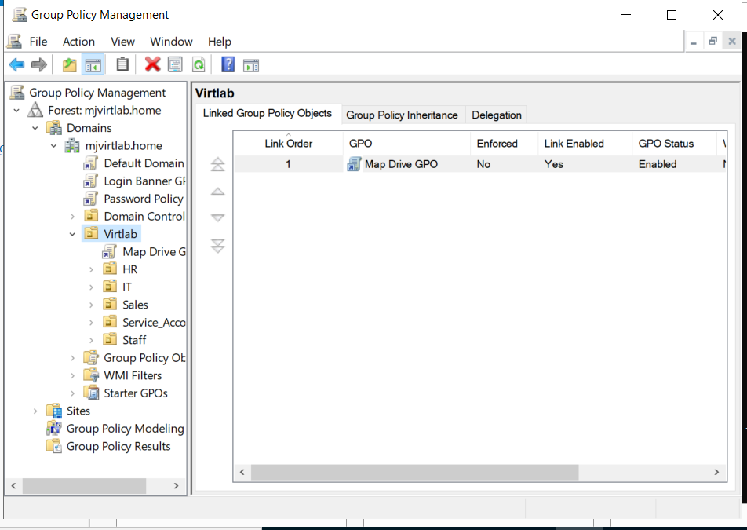
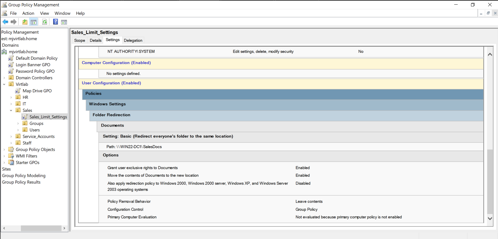

# Sales OU - GPO Configuration: Sales_Limit_Settings_GPO

This GPO was created to apply user experience limitations and additional security settings specific to the Sales department's Organizational Unit (OU). These restrictions ensure Sales users operate within a controlled desktop environment without administrative privileges or access to sensitive system areas.

## GPO Details

- **GPO Name:** Sales_Limit_Settings_GPO
- **Linked To:** OU=Sales
- **Created By:** Margaret Johnson
- **Created On:** 05/29/2025
- **Configured With:** Group Policy Management Console (GPMC)

## Purpose and Objectives

- Minimize distractions and access to control panel elements.
- Prevent accidental system changes by non-technical users.
- Reduce support tickets by preemptively disabling unnecessary UI options.

## Key Policy Settings

| Setting Category         | Configuration                             |
|--------------------------|-------------------------------------------|
| Control Panel Access     | Prohibit access to Control Panel and PC settings |
| Display Settings         | Hide display configuration settings       |
| Task Manager             | Disabled for standard users               |
| Run Command              | Disabled in Start Menu                    |
| File Explorer Restrictions | Hide specified drives and settings       |

## Implementation Steps

1. **Open Group Policy Management Console (GPMC)** on WIN22-DC1.
2. **Create GPO**: Right-click the Sales OU > "Create a GPO in this domain, and Link it here" > Name it `Sales_Limit_Settings_GPO`.
3. **Edit GPO** and apply the settings above using `User Configuration` > `Administrative Templates`.
4. **Link GPO** to the Sales OU.
5. **Force group policy update**: `gpupdate /force` from a client or wait for policy refresh.

## Verification Screenshots

- 
- 

## Lessons Learned

- Policy settings applied at the OU level are effective in enforcing department-specific rules.
- Testing GPO behavior with a standard user login is essential to validate intended restrictions.
- Documentation and consistent naming help track and audit GPO configurations across departments.