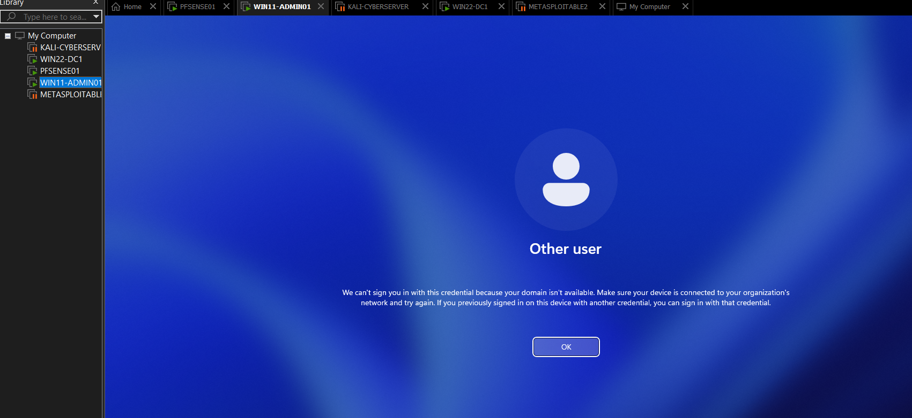
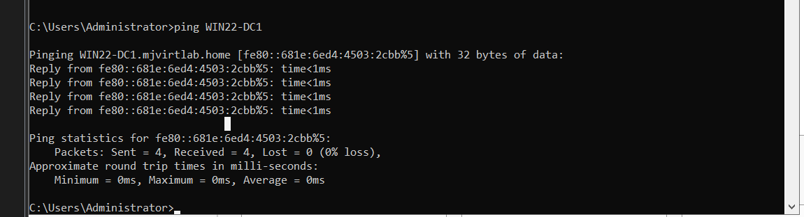
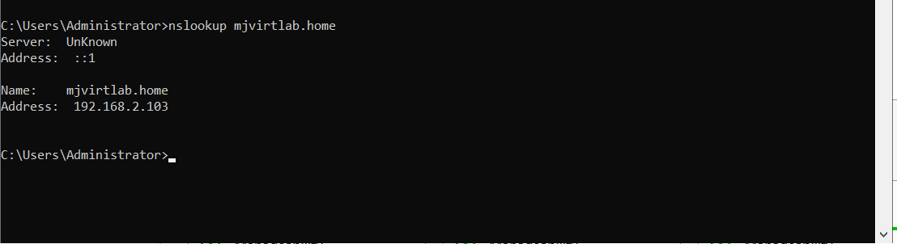
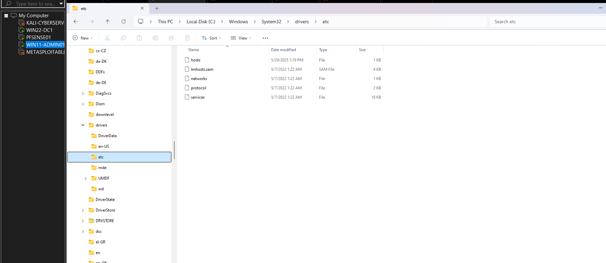
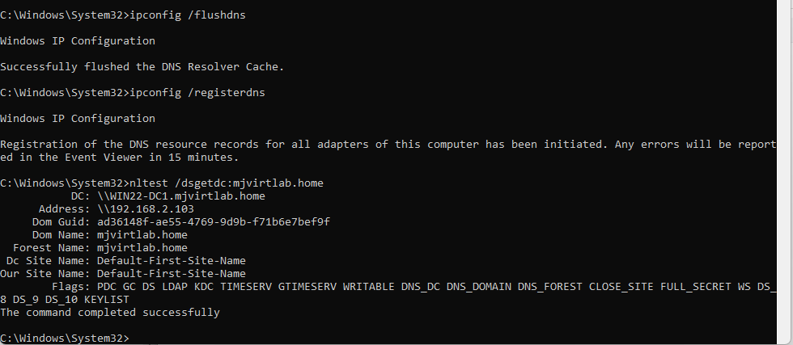

# 🛠️ Domain Join Debugging Lab – Hands-On Troubleshooting in Virtual Lab

This lab began when I encountered a frustrating login error while trying to connect my Windows 11 machine (`WIN11-ADMIN01`) to the domain `mjvirtlab.home` in my virtual lab environment. I had already created several Active Directory user accounts using the GUI, but when I attempted to log in as one of those users, I got the error: **“The user name or password is incorrect.”**  

Rather than just moving on, I saw this as a perfect opportunity to **slow down and document every step** of a real-world issue—just like I would on the job. I retraced the steps, captured screenshots, and resolved the problem by verifying and correcting network and DNS configuration issues.

---

## 🖥️ Lab Environment

| Machine         | OS                   | Role                  |
|------------------|----------------------|------------------------|
| WIN22-DC1        | Windows Server 2022  | Domain Controller      |
| WIN11-ADMIN01    | Windows 11 Pro       | Client Workstation     |

---

## 🎯 Objective

Simulate a real helpdesk/network support scenario where a Windows 11 client fails to join a domain. Document the full troubleshooting and resolution process to reflect practical IT skills that align with Help Desk Analyst and IT Support roles.

---

## 🔍 Initial Issue

After provisioning users in Active Directory, I attempted to log into the Windows 11 VM as:

```
mjvirtlab\swallace
```

But received this domain login error:



This triggered the lab.

---

## 🔧 Troubleshooting Steps

### 1️⃣ Checked IP Configuration on Both Machines

I ran `ipconfig` on both WIN11 and WIN22 to verify network settings.

- ✅ Confirmed both were on the same subnet `192.168.2.x`
- ❌ Noticed DNS was pointing to the gateway `192.168.2.1` on WIN11 (not the DC)

  


---

### 2️⃣ Tested Connectivity and Name Resolution

- Used `ping WIN22-DC1` to verify the DC was reachable.
- Ran `nslookup` and noticed the DC wasn't resolving correctly.

  


---

### 3️⃣ Inspected and Edited Hosts File (Fallback DNS Fix)

Opened the `hosts` file on WIN11:

```plaintext
C:\Windows\System32\drivers\etc\hosts
```

Added a manual entry to bind the DC’s name to its IP:

```plaintext
192.168.2.103    WIN22-DC1.mjvirtlab.home    WIN22-DC1
```

  


---

### 4️⃣ Manually Set DNS on WIN11

I configured the network adapter to use the domain controller as the DNS server:

- DNS set to `192.168.2.103`
- Disabled automatic DNS assignment

  
  


---

### 5️⃣ Flushed and Registered DNS Records

```bash
ipconfig /flushdns
ipconfig /registerdns
```



---

### 6️⃣ Verified Domain Trust Between Client and DC

From both machines, I used `nltest /dsgetdc:mjvirtlab.home` to ensure domain discovery was functional.

- ✅ WIN22 verified
- ✅ WIN11 verified

  
  


---

## ✅ Final Outcome

After resolving DNS and trust issues, the client successfully authenticated and joined the domain. I confirmed login access using:

```
mjvirtlab\swallace
```

---

## 📁 Folder Structure

```
Domain_Join_Debugging_Lab/
├── README.md
└── Screenshots/
    ├── WIN11_login_domain_error.png.png
    ├── Win11 ipconfig check.png
    ├── Win22 ipconfig check.png
    ├── Ping_WIN22.png
    ├── WIN22_nslookup.png
    ├── Host.png
    ├── WIN11_edit_hosts_file.png.png
    ├── WIN11_DNS dialog box showing no ip address listed.png
    ├── WIN11_Set DNS for Domain Join.png
    ├── WIN11_flushdns.png
    ├── WIN11_nltest_confirm_trust.png.png
    ├── WIN11_Verify Core Connectivity and Trust.png
    ├── WIN22_Verify Core Connectivity and Trust.png
    ├── WIN11 ethernet0_properties.png
```

---

## 🧠 What I Learned

- DNS misconfiguration is a **top reason** domain joins fail.
- You can use fallback methods like the `hosts` file when DNS fails.
- Always verify trust using `nltest`, not just GUI messages.
- Hands-on practice solidifies the theory behind **Active Directory, DNS, and TCP/IP**.

---

## 💡 Why This Matters

This project isn't just academic—**this is what I’d do in a real helpdesk or IT support role**. Instead of getting discouraged by an error, I treated it like a ticket, debugged it step-by-step, and fixed it using tools like:

- `ipconfig`
- `ping`
- `nslookup`
- `nltest`
- GUI networking tools
- Hosts file configuration

It’s all about showing that I can **solve real problems**, document my process, and keep learning as I go.

---

📌 _Project by Margaret Johnson – aspiring IT Help Desk and Cybersecurity Support Analyst._  
🔗 [Visit My GitHub Profile](https://github.com/Margaret-Johnson-ai)
