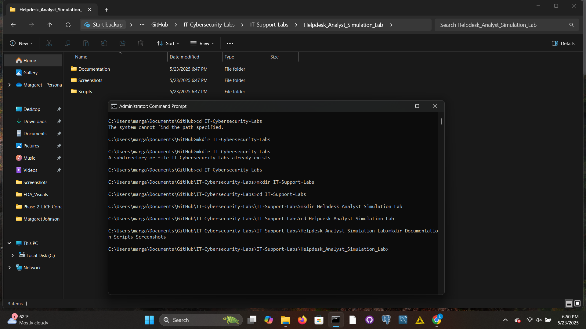

# 🖥️ Helpdesk Analyst Simulation Lab

_A hands-on IT support lab replicating real-world helpdesk analyst responsibilities._

---

## 🎯 Project Objective

This lab was designed to simulate a typical day-in-the-life of a Helpdesk Analyst supporting both office and retail environments. It showcases my ability to manage IT infrastructure, resolve tickets, configure endpoints, and document technical procedures.

---

## 🧪 Lab Scope

- Provision and manage **Active Directory user accounts**
- Configure **Microsoft 365 permissions**
- Simulate ticket intake and triage using a basic ticketing workflow
- Perform **remote troubleshooting and desktop support**
- Create **technical documentation** for repetitive support tasks
- Practice **endpoint configuration and imaging tasks**
- Maintain screenshots and code/scripts for all steps

---

## 📁 Folder Structure

- `Documentation/` – SOPs, config guides, ticket write-ups  
- `Scripts/` – CMD, PowerShell, or Python scripts used during simulation  
- `Screenshots/` – Evidence of tasks completed (setup, AD, 365, tickets, etc.)

---

## 🛠️ Tools Used

- Windows 11 (VM)
- Windows Server (for AD simulation)
- Microsoft 365
- GitHub Desktop + CMD + Notepad
- PowerShell / CMD
- [Optional] Spiceworks/Ticket Tool for simulated workflows

---

## 📸 Initial Setup

---
## 🧑‍💻 Virtual Lab Environment

This project is fully simulated in a home-based virtual lab using VMware Workstation. It includes:

- Windows 11 VM – simulating end-user workstation
- Windows Server 2022 VM – configured with Active Directory
- pfSense – for basic network segmentation
- Microsoft 365 Developer Tenant – to simulate real-world cloud-based user access

This setup allows me to simulate realistic helpdesk scenarios such as account provisioning, remote support, and endpoint troubleshooting — just as I would in a live IT environment.

---

## 🚀 Status

🔧 Folder and documentation setup complete  
🧪 Virtual environment active and ready  
✅ Next: Begin user provisioning and ticket simulation

---

## 🔗 GitHub Repository

[Click here to explore full project folder](https://github.com/Margaret-Johnson-ai/IT-Cybersecurity-Labs/tree/main/IT-Support-Labs/Helpdesk_Analyst_Simulation_Lab)
